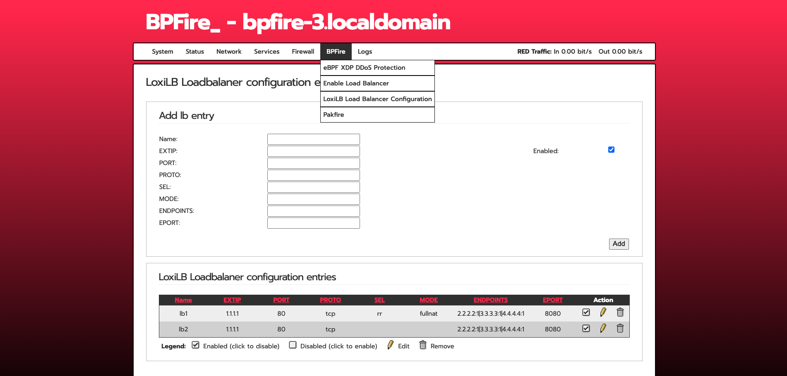
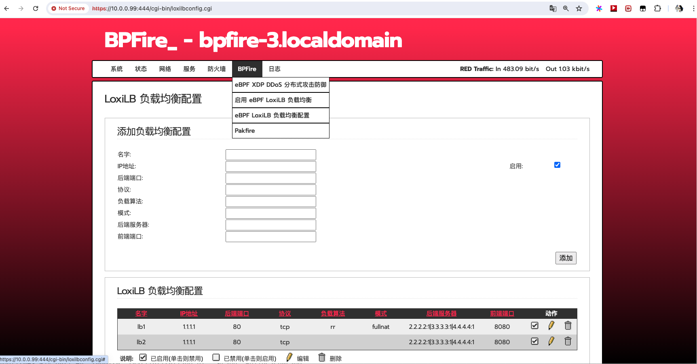
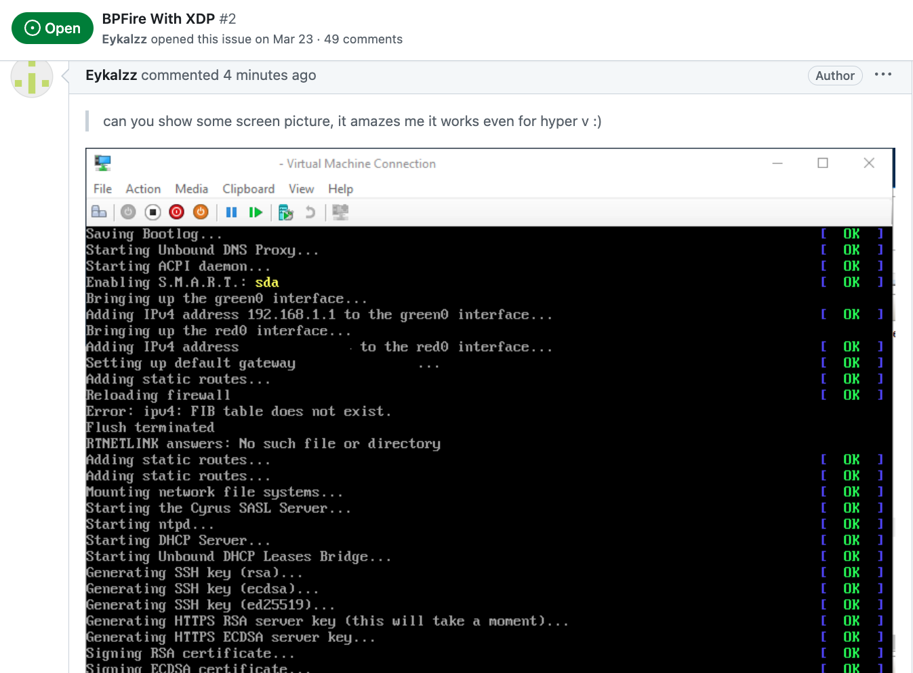
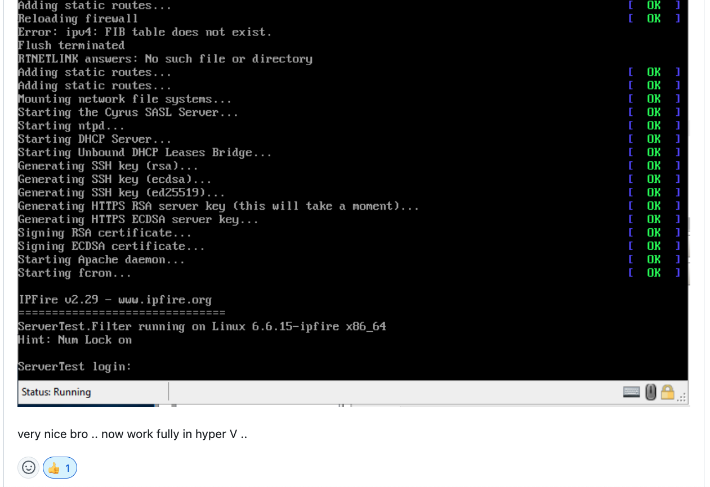

# BPFire - eBPF Network Firewall OS (eBPF 网络防火墙）

# What is BPFire?

BPFire is fork of [IPFire 2.x](https://github.com/ipfire/ipfire-2.x), a hardened, versatile, state-of-the-art Open Source firewall based on Linux. BPFire is to enable revolutionary [eBPF](https://ebpf.io/) technology for non-tech savvy users, make eBPF technology consumable to home users or any size of organizations to secure their network environment. Current supported eBPF network application features:

BPFire 基于IPFire 2.x, 一个基于Linux的安全坚固、多功能、先进的开源防火墙. BPFire 为普罗大众带来革命创新性的eBPF技术，为家庭用户或任何大小组织企业的网络安全保驾护航. 当前支持的eBPF应用包括：

1. XDP DDoS protection, See XDP SYNPROXY stops 10G DDoS SYN flood [here](https://www.youtube.com/watch?v=81Hgoy-x1A4)
2. XDP UDP DDoS online game protection
3. XDP DNS domain blocklist, ratelimit protection
4. XDP SSL/TLS server name indicator (SNI) blocklist
5. XDP GeoIP/Country blocklist
6. XDP multi attachment and capture mode for Intrusion Detection System Suricata in IPS mode
7. eBPF based LoxiLB load balancer, Firewall, Proxy, see full features [LoxiLB](https://loxilb-io.github.io/loxilbdocs/#overall-features-of-loxilb)

# Where can I get support?

Open github issue or [discord](https://discord.gg/EakRJaU8NG)

# Where can I get BPFire installation ISO or LoongFire flash image?

中国大陆用户下载地址:

[bpfire](https://www.vcn.bc.ca/~vli/bpfire/)

[loongfire](https://www.vcn.bc.ca/~vli/loongfire/)

Other download site:

[bpfire.net](https://bpfire.net/download/)

# What computer hardwares BPFire support?

BPFire support commodity computer hardware, small or large, old or new, cheap or expensive.

for example:

[X86 mini PC](https://www.aliexpress.com/w/wholesale-home-firewall-router.html?spm=a2g0o.best.search.0)

[LoongArch mini PC](https://www.aliexpress.us/item/3256807861547435.html?spm=a2g0o.order_list.order_list_main.5.6c6c1802f4v4tf&gatewayAdapt=glo2usa)

# How do I install BPFire?

flash the ISO to USB on Linux machine, /dev/sdc is your USB thrumb drive.

`dd if=bpfire-2.29-core184-x86_64.iso of=/dev/sdc status=progress`

BPFire installation on mini industrial PC:

[](https://www.youtube.com/watch?v=p9iHCe0hXPs "BPFire installation on mini industrial PC")

# BPFire SYNPROXY throughput with and without XDP acceleration under 10Gbit DDoS SYN flood:

[](https://www.youtube.com/watch?v=81Hgoy-x1A4 "Throughput performance")


# BPFire WebUI screenshot:

English:




Chinese:




# Does BPFire run in hypervisor virtual environment?

Yes, We have tested in Linux KVM hypervisor, Proxmox, Microsoft Hyper-v, should support Virtualbox, VMware as well.

Microsoft Hyper-v screen shot:





# How to build BPFire?

Build Environment Setup https://www.ipfire.org/docs/devel/ipfire-2-x/build-initial

(It takes a few hours to build image for first build depending on build machine power)

for example on Ubuntu 22.04 LTS:

```
apt install git-core g++ manpages-pl patch byacc make autoconf automake libltdl-dev

git clone https://github.com/vincentmli/bpfire.git

cd bpfire

wget --mirror --convert-links --adjust-extension --page-requisites --no-parent --cut-dirs=2 -nH --reject "index.html*" --reject "*.gif" https://www.bpfire.net/download/bpfire/cache/

./make.sh build

```

# How do I support BPFire development?

Join or [Donate to BPFire paypal](https://www.paypal.com/donate/?business=BL97G8687E5B6&no_recurring=0&item_name=Make+revolutionary+eBPF+technology+available+for+non-tech+savvy+users+for+safe+online+surfing&currency_code=USD)
