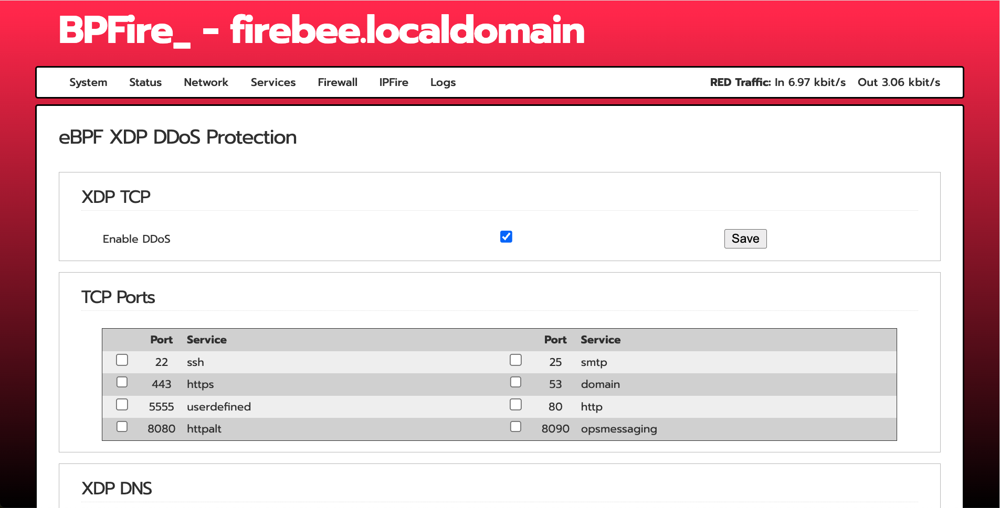
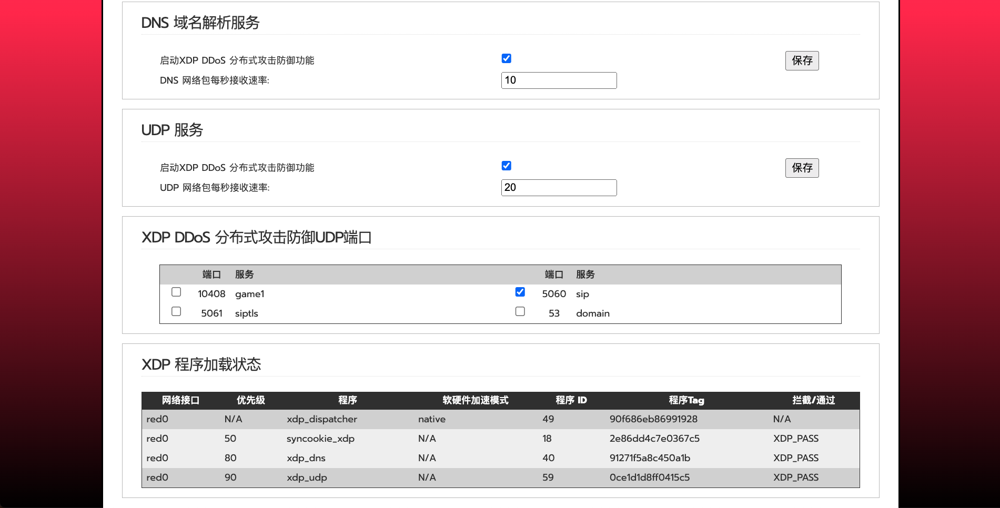

# BPFire - The Open Source Firewall

# What is BPFire?

BPFire is fork of IPFire 2.x, a hardened, versatile, state-of-the-art Open Source firewall based on Linux, BPFire extended IPFire 2.x with kernel eBPF support, allow packet filtering in kernel XDP/TC hook, which could bypass the Linux iptables packet filtering to speed up packet processing. Its ease of use, high performance in any scenario and extensibility make it usable for everyone. IPFire has a full list of features have a look [here](https://www.ipfire.org/features).

This repository contains the source code of BPFire which is used to build
the whole distribution from scratch, since BPFire is based on IPFire which is not based on any other
distribution.

# Where can I get BPFire installation image?

https://drive.google.com/drive/folders/1HPJTWP6wi5gPd5gyiiKvIhWipqguptzZ?usp=drive_link

# How do I use this software?

BPFire XDP DDoS feature demo:

IPFire have a long and detailed wiki located [here](https://wiki.ipfire.org/) which
should answers most of your questions for IPFire.

# BPFire WebUI screenshot:

English:

Chinese:

# But I have some questions left. Where can I get support?

You can ask your question by open github issue report or discussion or
You can ask your question at ipfire community located [here](https://community.ipfire.org/) that is IPFire related.

# How to build BPFire?

Build Environment Setup https://www.ipfire.org/docs/devel/ipfire-2-x/build-initial

git clone https://github.com/vincentmli/BPFire.git

cd BPFire

git checkout ipfire-bpf

wget http://www.bpfire.net/download/bpfire/cache.tar

tar xvf cache.tar

./make.sh build
